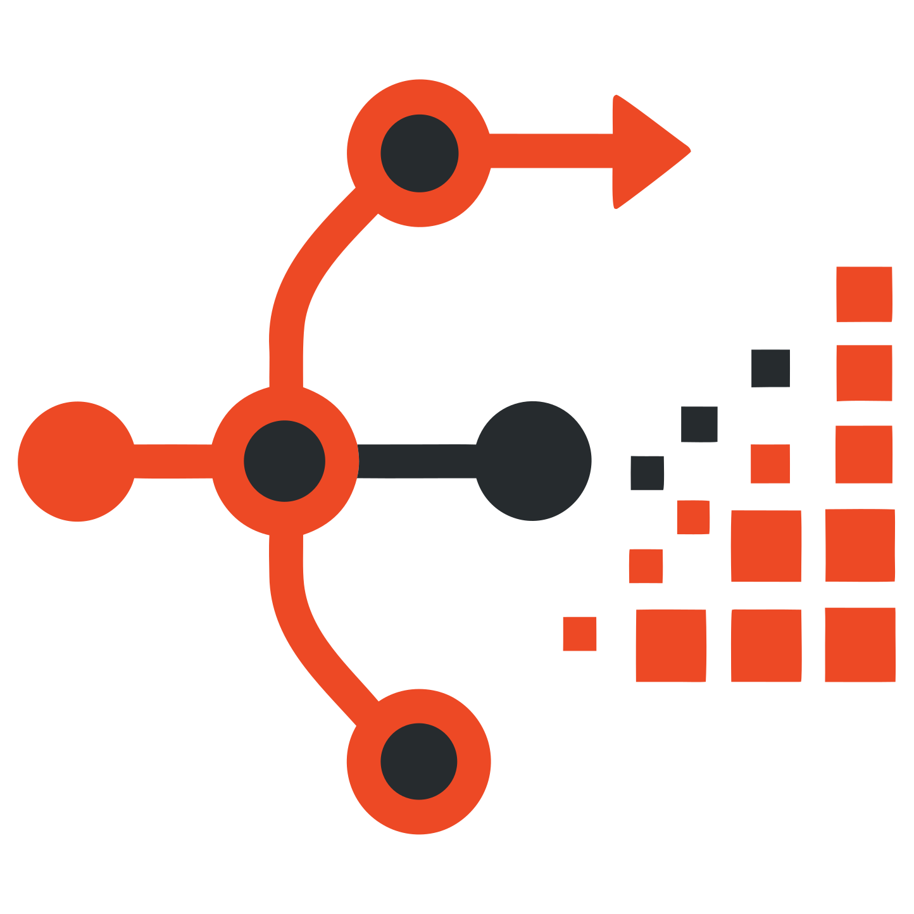

<p align="center">
  
</p>

<h1 align="center">git-tpl</h1>

<p align="center"><strong>Git-native project templates</strong></p>

<p align="center">
  <a href="https://github.com/noirbizarre/git-tpl/actions/workflows/ci.yaml">
    
  </a>
  <a href="https://codecov.io/gh/noirbizarre/git-tpl">
    
  </a>
  <a href="https://crates.io/crates/git-tpl">
    
  </a>
  
  <a href="https://noirbizarre.github.io/git-tpl/">
    
  </a>
  
</p>

---

git-tpl renders a template into a dedicated Git ref. Updating the template
advances that ref. You incorporate the changes with a normal `git merge`.

That is the whole idea. There is no reconciliation algorithm, no patch replay,
no conflict resolver — Git already has all of those, and they are better than
anything a template tool would write.

```
Traditional template tools:

    template  →  generated project  →  custom reconciliation  →  updated project

git-tpl:

    template  →  rendered Git ref  →  normal Git merge  →  updated project
```

## Install

```sh
cargo install git-tpl
```

The binary must be named `git-tpl` and be on your `PATH` — that is how Git
resolves `git tpl`.

## Use

```sh
cd my-project
git tpl init https://github.com/rawtools/rust-library-template
```

Later, when the template moves on:

```sh
git tpl status   # has the template changed?
git tpl update   # advance refs/tpl/<id> — your worktree is NOT touched
git tpl diff     # what would change
git tpl merge    # take it
```

## The model

```
main:  A ─── B ─── C ─── D ─── M
            /                 /
       G0 ─┴──────── G1 ─── G2       refs/tpl/<template-id>
```

`G0`, `G1`, `G2` are successive rendered states of the template. `M` is a merge
you ran. Every Git command works on the ref:

```sh
git show refs/tpl/rust-library
git log  refs/tpl/rust-library
git diff HEAD refs/tpl/rust-library
git merge refs/tpl/rust-library
```

**`git tpl update` never touches your branch.** Not the worktree, not the index,
not `HEAD`. It writes a Git tree directly and moves one ref.

**Template refs are never pushed automatically.** `git push` and `git pull`
ignore `refs/tpl/*`; `git tpl push` and `git tpl fetch` are explicit. A
contributor who clones the project and never runs git-tpl is unaffected by its
existence.

## Templates

A template is a normal Git repository with a `template.toml`:

```toml
name = "rust-library"

[questions.project_name]
type = "string"
prompt = "Project name"

[questions.project_type]
type = "choice"
prompt = "Project type"
choices = ["library", "application"]

[questions.cli]
type = "boolean"
prompt = "Create a CLI?"
when = "{{ project_type == 'application' }}"

[computed]
package_name = "{{ project_name | lower | replace(' ', '-') }}"
```

Rendering is [MiniJinja](https://docs.rs/minijinja), and only MiniJinja.
Templates cannot execute code — no hooks, no scripts, no embedded interpreter.

## Documentation

**[noirbizarre.github.io/git-tpl](https://noirbizarre.github.io/git-tpl/)**

- [The Git model](https://noirbizarre.github.io/git-tpl/concepts/git-model/) — start here
- [Quick start](https://noirbizarre.github.io/git-tpl/getting-started/quickstart/)
- [Template format](https://noirbizarre.github.io/git-tpl/templates/format/)
- [Architecture decisions](https://noirbizarre.github.io/git-tpl/adr/README/)

## Status

Early. The core model works end to end; see
[PLAN.md](PLAN.md) for what is implemented and what is not.

## License

MIT
