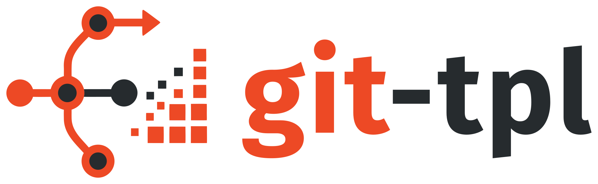

<p align="center" markdown>
  { width="360" }
</p>

**Git-native project templates.**

git-tpl renders a template into a dedicated Git ref.
Updating the template advances that ref.
You incorporate the changes with a normal `git merge`.

That is the whole idea.
There is no reconciliation algorithm, no patch replay, no conflict resolver — Git already has all of those, and
they are better than anything a template tool would write.

## The difference

Traditional template tools own the update:

```
template  →  generated project  →  custom reconciliation logic  →  updated project
```

git-tpl owns only the rendering:

```
template  →  rendered Git ref  →  normal Git merge  →  updated project
```

What that buys you is not subtle.
`git log refs/tpl/<id>` is the template's history.
`git tpl diff` is what the template would change.
`git merge refs/tpl/<id>` is the update, with the same three-way merge, the same conflict markers, the same
`git rerere`, the same `--abort` you already know.

## Getting started

```sh
brew install noirbizarre/tap/git-tpl

cd my-project
git tpl init https://github.com/noirbizarre/rust-library-template
```

Homebrew is one of five ways in — see [Installation](getting-started/installation.md).
`cargo install git-tpl` places only the binary, so `git tpl --help` reports *No manual entry for git-tpl* until
the man page is generated; the other methods include it.

That works on an empty repository and on a project that already has files — see
[adopting an existing project](usage/init.md#an-existing-project).

Later, when the template moves on:

```sh
git tpl update   # advances refs/tpl/<id> — your worktree is NOT touched
git tpl diff     # what would change
git tpl merge    # take it
```

## Two things worth knowing up front

**`git tpl update` never touches your branch.** Not the worktree, not the index, not `HEAD`.
It writes a Git tree directly and moves one ref.
You decide when to merge, and merging is an ordinary Git operation you can abort.

**Template refs are not pushed automatically.** A contributor cloning the project does not need template state to
work on it.
`git push` and `git pull` ignore `refs/tpl/*` entirely; `git tpl push` and `git tpl fetch` are explicit.

## Read next

* [Installation](getting-started/installation.md) — get the binary onto your `PATH`
* [Quick Start](getting-started/quickstart.md) — a template and a project in five minutes
* [The Git model](concepts/git-model.md) — **start here to understand the tool**
* [Template format](templates/format.md) — `template.toml`, questions, rendering
* [Architecture decisions](adr/README.md) — why it is built this way

## What git-tpl deliberately is not

!!! warning "This is not a project generator"

    Generating files is the least interesting thing a template tool does.
    It is the *second* and *hundredth* update that is hard, and git-tpl's answer to that is to not solve it — to
    produce a Git state and let Git do the rest.

Templates cannot execute code.
There are no hooks, no post-generation scripts, no embedded Python, no shell.
Dynamic behaviour is [MiniJinja](https://docs.rs/minijinja) expressions over a controlled context, and nothing
else.
See [Security](concepts/determinism.md#security).

Compatibility with Copier or Cruft is not a goal.
They are useful references when weighing a design decision, and that is all.
